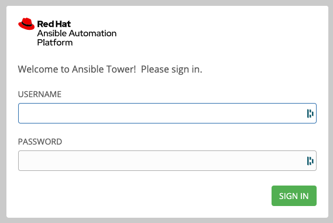
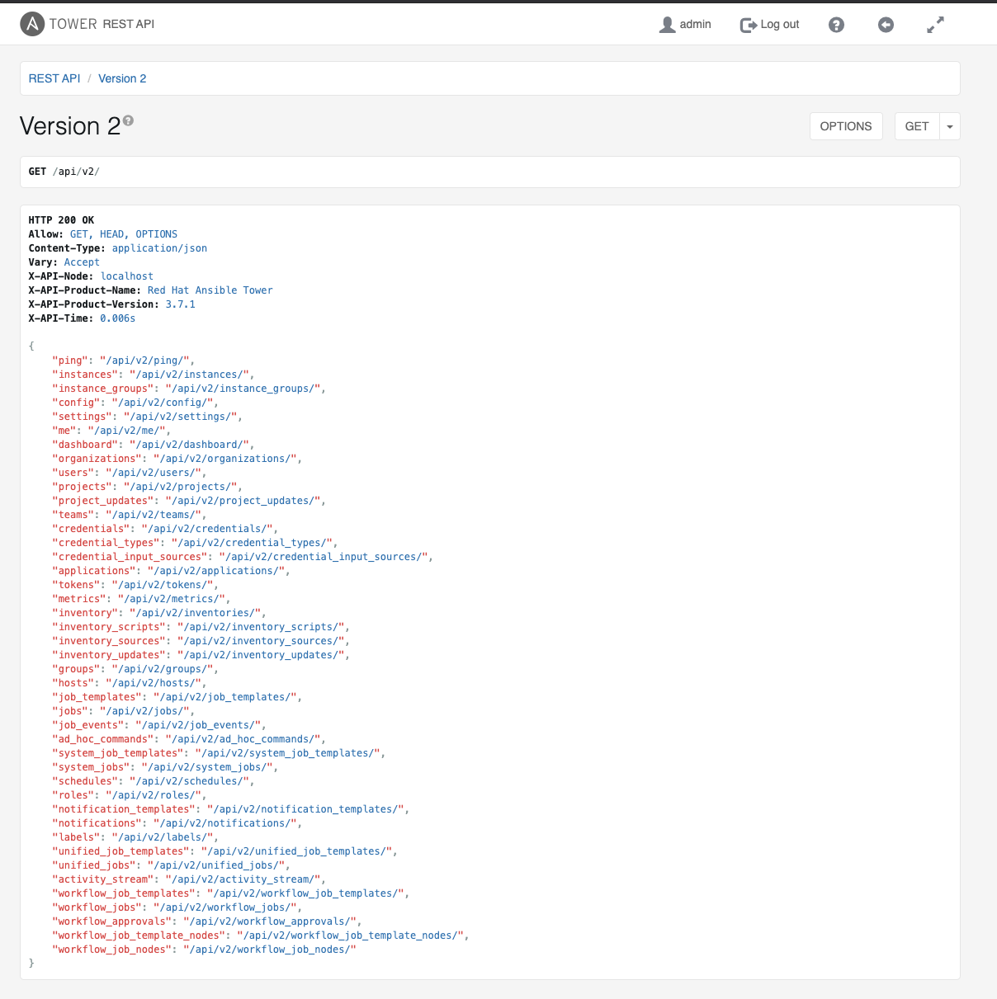
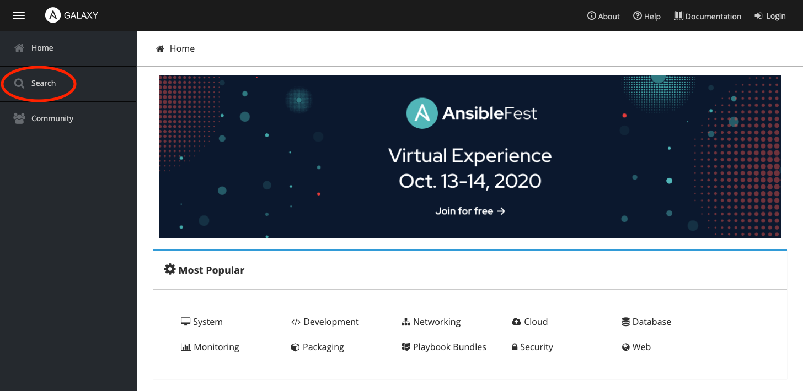
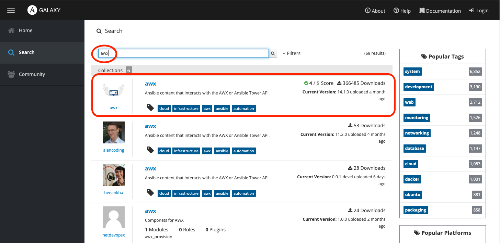
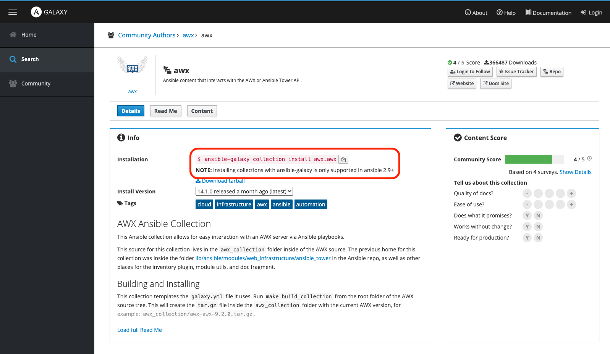
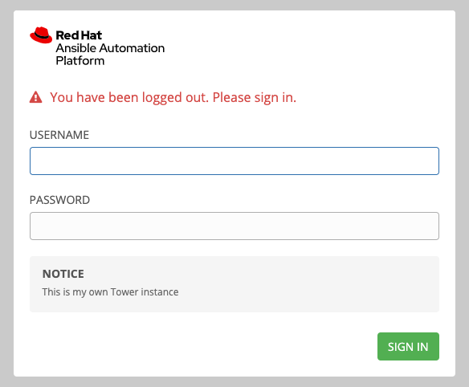

## Introduction to Your Lab Environment

Your lab environment consists of a pre-installed Ansible Tower instance with no assets (inventories, projects, etc) pre-installed. In addition to an instance of Ansible Tower, your environment also includes a control node and 3 additional machines. For this lab, we will only be interacting with the Ansible Tower instance.

To start, let’s look at your Ansible Tower instance. Open a browser and go to the Tower URL assigned to you. You should see a login screen that looks like this:



Note that there is no custom login message below the login information; we will change this as one of our first tasks.


### Authenticate to Tower

Go ahead and login as the **`admin`** user with the provided password to validate that your credentials are working properly. Once you are logged in, feel free to click through Ansible Tower’s web UI to confirm that nothing has been auto-created in your environment.

Now we will test the SSH access to your Ansible Tower server by logging in to the command line of your Ansible Tower instance. To do this, use the command provided in the terminal (note, change the username and host to reflect what was assigned to you):

```
$ ssh student1@student1.95c5.open.redhat.com
The authenticity of host 'student1.95c5.open.redhat.com (100.27.40.58)' can't be established.
ECDSA key fingerprint is SHA256:mQHurXaJloms4JtlzcqdYgcsLkQApM0j0ma0OJwnOo4.
Are you sure you want to continue connecting (yes/no/[fingerprint])? yes
Warning: Permanently added 'student1.95c5.open.redhat.com,100.27.40.58' (ECDSA) to the list of known hosts.
student1@student1.95c5.open.redhat.com's password: <enter password here>
This system is not registered to Red Hat Insights. See https://cloud.redhat.com/
To register this system, run: insights-client --register

Last login: Fri Sep  4 14:55:18 2020 from 73.182.231.128
```

Once logged in, let’s check the version of Ansible available to us:

```
[student1@ansible-1 ~]$ ansible-playbook --version
ansible-playbook 2.9.13
  config file = /home/student1/.ansible.cfg
  configured module search path = ['/home/student1/.ansible/plugins/modules', '/usr/share/ansible/plugins/modules']
  ansible python module location = /usr/lib/python3.6/site-packages/ansible
  executable location = /usr/bin/ansible-playbook
  python version = 3.6.8 (default, Dec  5 2019, 15:45:45) [GCC 8.3.1 20191121 (Red Hat 8.3.1-5)]
[student1@ansible-1 ~]$
```

Collection support started in Ansible 2.9, so our version of 2.9.13 should be sufficient for us to complete this lab.

> **Note:** this machine happens to be our Ansible Tower machine. You can confirm this by running the following command:


```
[student1@ansible-1 ~]$ ansible-tower-service status
● ansible-tower.service - Ansible Tower service
   Loaded: loaded (/usr/lib/systemd/system/ansible-tower.service; enabled; vendor preset: disabled)
   Active: active (exited) since Fri 2020-09-04 14:15:58 UTC; 1h 0min ago
  Process: 35549 ExecStart=/bin/true (code=exited, status=0/SUCCESS)
 Main PID: 35549 (code=exited, status=0/SUCCESS)
    Tasks: 0 (limit: 23878)
   Memory: 0B
   CGroup: /system.slice/ansible-tower.service
...
<press q to end the data stream>
```

> **Note:** It is not recommended to use the Ansible Tower server as a development server; however, due to limited resources in the lab environment we will use this node as a control node as well.


## Using `tower_setting` to Set the Welcome Message

Now, let’s start using the AWX collection to modify the welcome message on our Ansible Tower server. To do this we need to create files on the server provisioned for you. If you are comfortable with command line editors (like `vi`) you are welcome to do that for the duration of the lab. Another way to perform the examples is to use the VSCode Server  provided by the lab. To do this, start by clicking on the UI link in the “VS Code access” provided with your credentials:


Enter the provided password and click submit:


This will log you into a web-based version of VS Code:


Any files that you create here will be available in your home directory on the server. In addition, you can click on the Terminal menu and then New Terminal to get a terminal directly on the server where you can run commands.

Whatever method you choose (VSCode or direct terminal access), create a playbook file called `tower.yml` and populate it with the following content:

```
    ---
    - name: Customize My Tower Instance
      hosts: localhost
      connection: local
      gather_facts: False
      collections:
        - awx.awx

      tasks:
        - name: Set my login message
          awx.awx.tower_settings:
            name: "CUSTOM_LOGIN_INFO"
            value: "This is my own Tower instance"
```

Since this will be very similar on all of the playbooks we write, let’s quickly go over this playbook.

First, we are giving the play a name with the directive:

```
    - name: Customize My Tower Instance
```

Next, we are telling Ansible that we only need to connect to `localhost` for this play:

```
      hosts: localhost
```

The AWX Collection modules will use parameters to tell it how to connect to the Ansible Tower host to perform the configuration. Because of this, we don’t need to have Ansible SSH to a specific node for configuration.

Next, we tell Ansible to connect with a local connection (instead of SSH) and to not gather facts:

```
      connection: local
      gather_facts: False
```

This is something you may or may not need to do for your environment and for the purpose of your playbook.

For the last header element, we are telling Ansible that we want to use the `awx.awx collection`:

```
      collections:
        - awx.awx
```

> **Note:** There are two collections `awx.awx` and `ansible.tower`. The `awx.awx ` is the upstream version of the collection intended for use with awx. Its source is embedded within the AWX source code. The `ansible.tower` collection is intended for use with Red Hat Ansible Tower. This collection is distributed via Content Hub and is officially supported by Red Hat. For this lab, we will use the `awx.awx` collection. In production you should use the `ansible.tower` collection. For the purposes of this lab the two collections are nearly identical.

Finally, we have a single task:

```
      tasks:
        - name: Set my login message
          awx.awx.tower_settings:
            name: "CUSTOM_LOGIN_INFO"
            value: "This is my own Tower instance"
```

This task uses the **tower_settings** module from the `awx.awx collection` to set the tower setting **CUSTOM_LOGIN_INFO** to a specific value.

> **Note**: Because we are including the collections tag above you can reference the module as just `tower_settings` instead of `beeankah.awx.tower_settings`. However, remember that some versions of Ansible still contain the old built-in module with the same name. If the collections tag is not present and the `tower_settings` is not fully qualified with the collection name, Ansible may try to use the old version of the module which behaves slightly differently and requires the tower-cli library to function. Most of the new modules in the Collection do not have requirements on additional libraries. There are a couple of modules that are exceptions which we will talk about later.

If you want to view the current value of your Ansible Tower’s `CUSTOM_LOGIN_INFO` you can do this in your web browser. In the Web UI go to `Settings => User Interface` and your current `CUSTOM_LOGIN_INFO` should be empty:


> **Note:** Ansible Tower is an “API first” application. This means that there is a robust API behind the Web UI and nothing can be done within the Web UI that cannot be done from the API. The AWX Collection communicates directly with the API to manage an instance of Tower just like the Web UI does.

Because of the above note, we can also view our `CUSTOM_LOGIN_INFO` from the API. The API can be viewed with a web browser just the Web UI. In your browser you should be looking at a URL like: [https://student1.95c5.open.redhat.com/#/settings/ui](https://student1.95c5.open.redhat.com/#/settings/ui) (your hostname will be different). This is the URL for Web UI settings. To get to the API change the path of the URL from [/#/settings/ui](https://student1.95c5.open.redhat.com/#/settings/ui) to `/api/v2`. This will render the API V2 landing page:




From this page, to find our `CUSTOM_LOGIN_INFO` setting, click on the settings link (`/api/v2/settings/`) and then scroll down in the list of possible settings to find `/api/v2/settings/ui` and click on that.

> **Note:** you can also just update the path in your browser's URL to achieve the same effect.

The `/api/v2/settings/ui` page renders a list view like:


Here we can see that `CUSTOM_LOGIN_INFO` is also an empty string:

```
    "CUSTOM_LOGIN_INFO": "",
```

The API is less friendly for humans but is perfect for machine-to-machine connections. This is why the AWX collection talks with Tower through the API instead of the Web UI.

So, let's run our playbook to update our `CUSTOM_LOGIN_INFO`. This can be done from the command line or by opening a terminal in VSCode and running the command within the terminal:

```
[student1@ansible-1 ~]$ ansible-playbook tower.yml
ERROR! couldn't resolve module/action 'awx.awx.tower_settings'. This often indicates a misspelling, missing collection, or incorrect module path.

The error appears to be in '/home/student1/tower.yml': line 10, column 7, but may
be elsewhere in the file depending on the exact syntax problem.

The offending line appears to be:

  tasks:
    - name: Set my login message
      ^ here
```

To fix this, we will need to install the `awx.awx `collection from ansible galaxy so that the new version of the module can be found. First, let's look at the collection out on the galaxy website. Got to [https://galaxy.ansible.com](https://galaxy.ansible.com) and select the search option on the left hand side:




In the search bar enter “awx” and press enter to search. This will show you the official AWX collection (which has the follicial logo), click on that collection:




On the AWX Collection page, galaxy will show us the `ansible-galaxy` command that we need to run in order to install the collection:




Let’s go ahead and run the command to perform the installation:

```
[student1@ansible-1 ~]$ ansible-galaxy collection install awx.awx
Process install dependency map
Starting collection install process
Installing 'awx.awx:14.1.0' to '/home/student1/.ansible/collections/ansible_collections/awx/awx'
```

We are telling `ansible-galaxy` that we want to perform an install of `awx.awx` and that it is a Collection, not a role that we want installed. Ansible Galaxy will then connect to `galaxy.ansible.com`, find and download our collection and install it into your `.ansible` folder for personal use. If there was another user on your control node, they would need to perform this step as well to get the Collection into their home account or we would need to configure a “shared” collection area and point Ansible to it. This can be done with the `COLLECTIONS_PATH` configuration setting [https://docs.ansible.com/ansible/latest/reference_appendices/config.html#collections-paths](https://docs.ansible.com/ansible/latest/reference_appendices/config.html#collections-paths).  

> **Note:** It is possible to install a Collection next to your playbook similar to how roles can be installed. However, this is not recommended for the `awx.awx collection`. This is because the `awx.awx` and corresponding `ansible.tower collections` come pre-shipped with AWX/Tower and the pre-shipped versions are the corresponding compatible versions. We will see in a moment what happens when you run a non-compatible version.

Now that we have our collection installed let’s run our playbook again:

```
[student1@ansible-1 ~]$ ansible-playbook tower.yml

PLAY [Customize My Tower Instance] ******************************************************************************

TASK [Set my login message] ******************************************************************************
[WARNING]: Failed to release tower token None: hostname '127.0.0.1' doesn't match 'student1.95c5.open.redhat.com'
fatal: [localhost]: FAILED! => changed=false
  msg: 'There was an unknown error when trying to connect to https://127.0.0.1/api/v2/settings/all/: CertificateError hostname ''127.0.0.1'' doesn''t match ''student1.95c5.open.redhat.com'''

PLAY RECAP ******************************************************************************
localhost: ok=0 changed=0 unreachable=0 failed=1 skipped=0 rescued=0 ignored=0   
```

With the Collection installed, we no longer get a parsing error when our playbook tries to run the `awx.awx.tower_setting` module; instead we now get a connection error. Our new error message talks about an unknown error when trying to connect to `127.0.0.1`. This is because we did not provide any authentication information to the module on how to connect to Ansible Tower. By default, the modules try to talk to `127.0.0.1` (aka `localhost`) which in our case is a valid host but it has no username/password to authenticate with and, if you look closely at the error, it is reporting that the SSL certificate it got from `127.0.0.1` does not match the host name within the certificate. By default, the Ansible Tower modules will verify the SSL certificate before installing.

Authentication information can be passed to the module in several ways, but before we discuss that, let's talk about authentication for Ansible Tower in general. Ansible Tower can use username/password for authentication in addition to using OAuth2Tokens. OAuth2Tokens are a great way to allow for machine-to-machine connections. The modules can leverage either method of authentication and will prefer using OAuth2Tokens over a username/password combination. In fact, when using a username/password, the modules will grab a token “on the fly” and release the token when it's completed its work.

For passing login information to the module, there are three supported methods:

1. _Parameters Provided Directly to the Module_

    These have the highest priority of any method. The following parameters are supported:

- `tower_host`: The URL to your instance
- `tower_username`: The user to log in as
- `tower_password`: The user’s password
- `tower_oauthtoken`: The token to use (preferred over username/password)
- `validate_certs`: Indicates whether to ignore the SSL certificate provided by the server or not
- `tower_config_file`: A pointer to a specific configuration file

2. _Set Environment Variables_

    All of the above parameters have corresponding environment variables, these variables have the same precedence as the parameters above:

- `TOWER_HOST` will map to `tower_host`
- `TOWER_USERNAME` will map to `tower_username`
- `TOWER_PASSWORD` will map to `tower_password`
- `TOWER_OAUTH_TOKEN` will map to `tower_oauthtoken`
- `TOWER_VERIFY_SSL` will map to `validate_certs`

> **Note:** `tower_oathtoken` and its `ENV` variable are slightly different, `validate_certs` and its `ENV` variable are also slightly different (`tower_verify_ssl` is a parameter alias to `validate_certs`) and `tower_config_file` cannot be set by an `ENV` variable.

3. _Legacy `tower-cli` Configuration Files_

    The new modules follow the same format and loading precedence of the original `tower_*` modules that came bundled with Ansible. If your server and development practices are configured to use these files they will work the same with the new Collection. We will talk about this more later on.

> **Note:** This method of authentication is for legacy purposes and _not_ recommended for new development.

For this lab, we are going to use environment variables to pass in our login information. We will only need to do this once per shell and it will take effect for all of our executions of `ansible-playbook`. This will be akin to how we will run the collection in Ansible Tower. To do this, run the following commands (substituting the appropriate values):

```
[student1@ansible-1 ~]$ export TOWER_HOST=https://[your tower link]
[student1@ansible-1 ~]$ export TOWER_USERNAME=admin
[student1@ansible-1 ~]$ export TOWER_PASSWORD=[your password]
```

> **Note:** Please remember if you open a new shell or start a new sub-shell, you will need to set the environment variables in that shell for your playbooks to work properly.

We can now run this playbook and it will connect to our Ansible Tower instance, change the setting, and give us the following output:

```
[student1@ansible-1 ~]$ ansible-playbook tower.yml

PLAY [Customize My Tower Instance] *****************************************************************************

TASK [Set my login message] *****************************************************************************
[WARNING]: You are using the awx version of this collection but connecting to Red Hat Ansible Tower
changed: [localhost]

PLAY RECAP ****************************************************************************
localhost: ok=1 changed=1 unreachable=0 failed=0 skipped=0 rescued=0 ignored=0   
```


We can tell that the server was changed from the “`changed`” status that is shown in the output. We can verify this in our Ansible Tower web UI:


Or via the API:

```
   "CUSTOM_LOGIN_INFO": "This is my own Tower instance",
```

Or by logging out of Ansible Tower and looking at the login notice there:




If we re-run our playbook, we will see that the modules are idempotent and will correctly tell us that the Ansible Tower server was in the correct state:

```
[student1@ansible-1 ~]$ ansible-playbook tower.yml

PLAY [Customize My Tower Instance] *****************************************************************************

TASK [Set my login message] *****************************************************************************
[WARNING]: You are using the awx version of this collection but connecting to Red Hat Ansible Tower
ok: [localhost]

PLAY RECAP *****************************************************************************
localhost: ok=1    changed=0    unreachable=0    failed=0    skipped=0    rescued=0    ignored=0   
```

If you manually change the login message through the UI and run the playbook again, your Ansible Tower configuration will go back to the state defined in the playbook.

Notice the warning message we have been receiving:

```
[WARNING]: You are using the awx version of this collection but connecting to Red Hat Ansible Tower
```

The Collections are built for specific versions of AWX and Tower. In our case, we are using an AWX version of the collection to connect to a Red Hat Ansible Tower instance. The collection is giving us a warning about this. It will try its best but as the API changes from version to version, an older version of the collection may not work with a new version of AWX.

If we were connecting to the wrong version of the right software we would receive a message like:

```
[WARNING]: You are running collection version 3.7.0 but connecting to tower version 3.7.1
```

Again, the module will still attempt to execute as it’s designed to and, so long as the API hasn’t radically changed, it will most likely succeed at what it was trying to do.

Now that we have been introduced to the collection and our environment, let’s begin to do some more advanced work.
