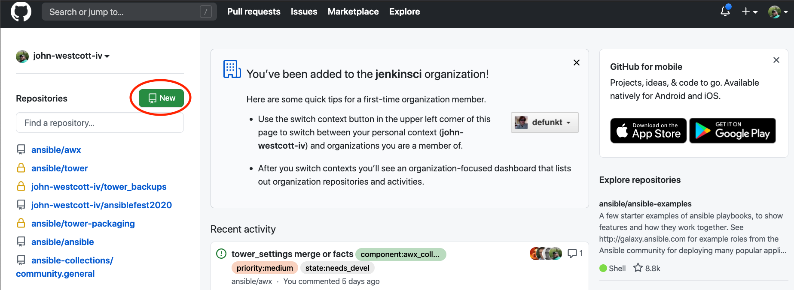
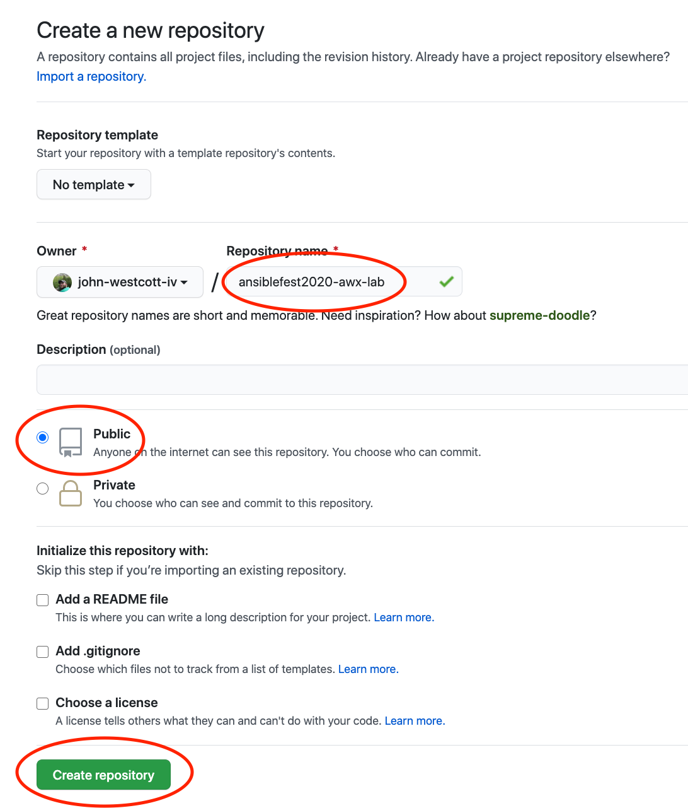
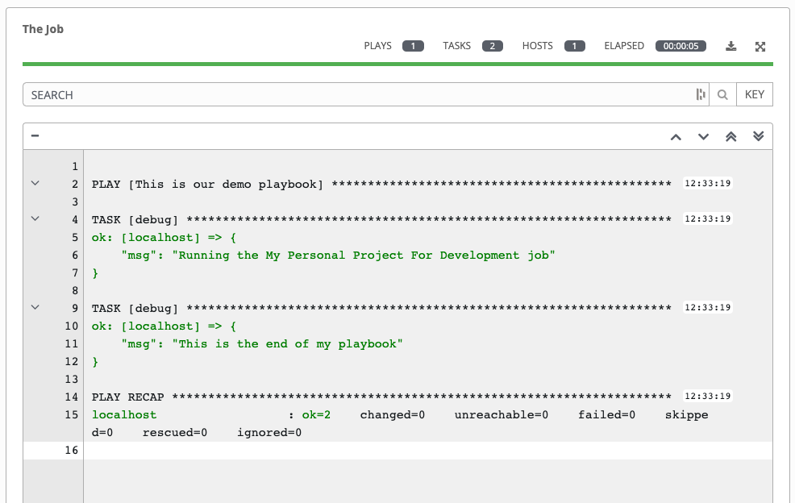
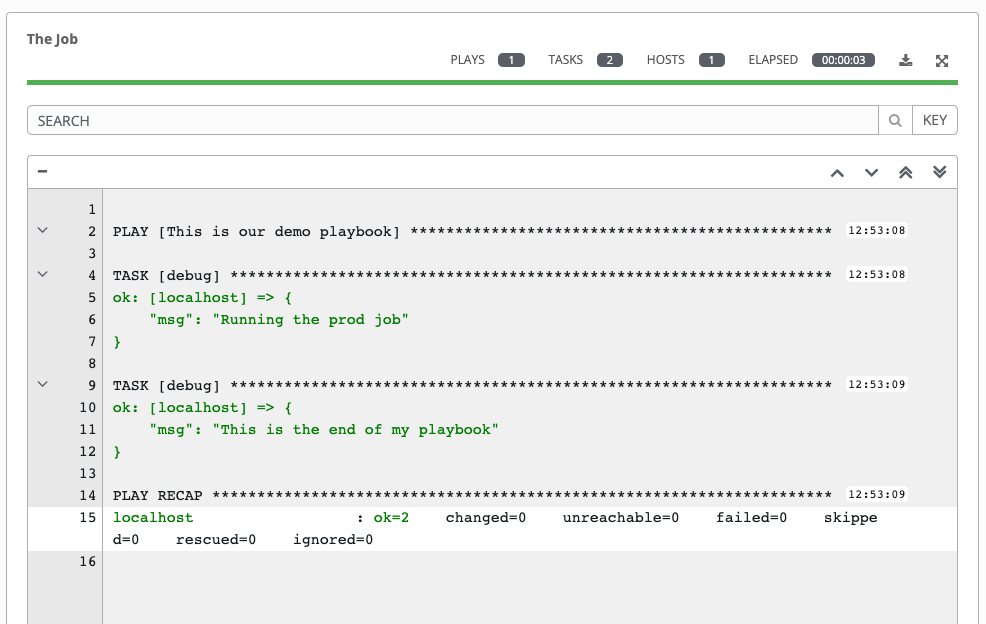
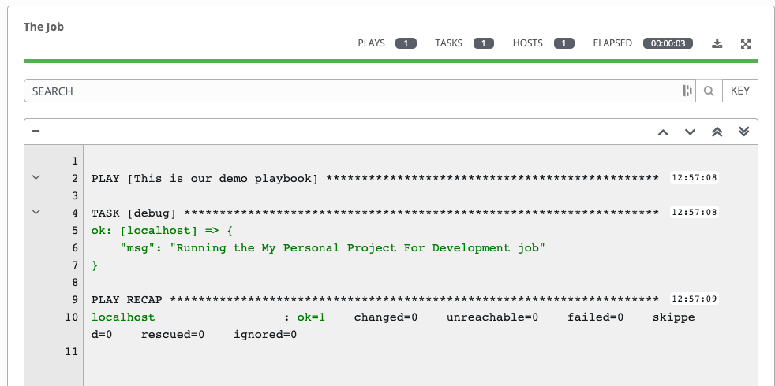
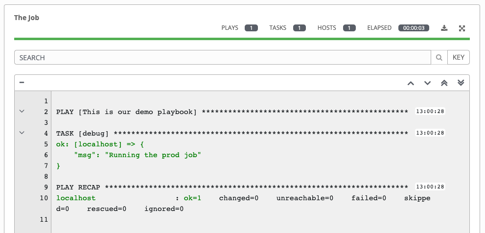

## Creating a Simple Migration Plan

In this next exercise we will work on making a migration path for job templates. Normally this might be something done between development and production, but since we only have a single Ansible Tower instance we will do this between two projects. Here is a picture of the scenario we are trying to create:


We want a developer to be able to create a Job Template from a Development Branch of a repository in our Development Project. And we want our operations team to be able to execute the Job Template from the Production project. The playbook will be managed and migrated by pull requests in GitHub but we want our job template definition to have a migration process so our developers don’t need to have access to the jobs in production.


### Create GitHub Project

> **Note**: If you do not have access to GitHub to create a project, there is a URL for a project I have created. However, you will not be able to make commits to my GitHub repo.

First, you need to create a repository in GitHub (or other SCM) to house your work. The following instructions assume GitHub; if you are using another SCM you will need to adjust the instructions to that SCM.

Go to [github.com](https://github.com/) and log in if you aren’t logged in yet. On the main screen, click on “New” in the repository section:




On the new repository screen give your repo a name, make sure its marked as public, leave all other settings alone and then click on Create Repository:




This will take you to a new blank repository screen. Click the HTTPS button next to the URL and then copy the HTTPS URL of your repository on this screen:


### Clone and Create Assets

Now that we have a repository URL, we can clone it to our workstation with the command:

```
[student1@ansible-1 ~]$ git clone <url>
Cloning into 'ansiblefest2020-awx-lab'...
warning: You appear to have cloned an empty repository.
```

This creates a clone of our repository from GitHub (which happens to be empty) into a directory with the same name as the repository. Note via the bolded text above that it tells you what directory it creates.

Now change to your repository with the `cd` command:

```
[student1@ansible-1 ~]$ cd <directory>
```

Create a new branch called production:

```
[student1@ansible-1 ~]$ git checkout -b production
```

We will now create a mock playbook called `demo.yml`:

```yml
---
- name: This is our demo playbook
  hosts: localhost
  connection: local
  gather_facts: False
  tasks:
    - debug:
        msg: "Running the {{ twr_env | default('Unknown') }} job"

    - debug:
        msg: "This is the end of my playbook"
      tags:
        - debug_messages
```

And commit this new file into the production branch:

```
[student1@ansible-1 ~]$ git add demo.yml
[student1@ansible-1 ~]$ git commit -m 'Initial commit' demo.yml
[student1@ansible-1 ~]$ git push --set-upstream origin production
```

We should now be able to see the production branch in GitHub by reloading your repository page:


Let’s now create our development branch starting from where development is right now:

```
[student1@ansible-1 ~]$ git checkout -b development
[student1@ansible-1 ~]$ git push --set-upstream origin development
```


### Tower Setup

Our bootstrap process created everything we will need for our migration. It created an organization called “Export Org” and created a workflow there. In addition, it created Production and Development orgs and projects (which are currently tied to my repository) as well as a dev and ops user. Let’s review some of what it has done. Start by logging into the Tower Web UI as admin. You will be able to see both our Development and Production projects. If you open them they will be tied to my GitHub instance and to their respective branches:


Update the SCM URL to point to your repository. While that is updating, let’s take a look at the “Migrate Job Templates” workflow. The workflow is fairly simple consisting of two nodes (export and import):


The export assets node is executing the job template “Export Assets” which is tied to the playbook [https://github.com/john-westcott-iv/ansiblefest2020/blob/devel/export.yml](https://github.com/john-westcott-iv/ansiblefest2020/blob/devel/export.yml). This job template is looking for our Development project and then using the `tower_api` lookup plugin to find all of the job templates which are tied to that project. In addition, it is using the `lookup_api` plugin to also get the survey specs associated with those jobs.

The “Import Assets” job template is tied to [https://github.com/john-westcott-iv/ansiblefest2020/blob/devel/import.yml](https://github.com/john-westcott-iv/ansiblefest2020/blob/devel/import.yml) and is looping over the exported data and using `tower_job_template` to import it. Notice on line 26 that it is overriding the project and setting it to our “Production” project. In line 32 it is adding an `extra_var` of `twr_env` making sure it’s set to ‘prod’. After the import it makes sure that our ops user has execute permissions on all of the imported jobs.

The question you might be wondering is: Why two job templates and a workflow instead of just one job template? The answer, like we’ve already discussed, is RBAC scope. The jobs in the operations project will have the same name as the development project. To make things easy, I put the two projects in their own organizations and I’m running the job templates with different Ansible Tower credentials that log in as their respective org admins. Because of this, we should never get naming conflicts. Also, remember that this situation is intended to be for a use case with two Ansible Tower instances; in that case, the credentials would likely need to be different. Having two job templates facilitates this.

Log out and then log back in as the operations user:

**User**: `ops`

**Password**: `ops123!`

Notice that the ops user has access to nothing. No templates, no project, not credentials, etc.

Next, log out and log back in as the dev user:

**User**: `dev`

**Password**: `dev123!`

As the dev user you should see more than the ops user but still very little. You can see an inventory, the Development project and two templates. One workflow template called “Migrate Job Templates” with execute-only permissions and one job template called “The Job” with edit permissions. The “Migrate Job templates” workflow allows us to promote “The Job” over to the Production project and enable the ops user to execute it (as discussed).

Edit “The Job” and add a variable called `twr_env` in the extra variables setting it to anything you like:

```
    ---
    twr_env: "My Personal Project For Development"
```

Save the template and execute the job. You will see your `twr_env` in the first message and then our end of play message:




This looks good so far, so we can run the Migrate Job Templates workflow to migrate our job template so the ops user can run it. Click on Templates and then click the launch button next to Migrate Job Templates.

After it completes successfully, log out of the dev user and log in as the ops user (with the `ops123!` password), You should now be able to see the one job template you can execute:


Edit “The Job” you should see that it looks identical to “The Job” that the dev user created for you with the exception that the extra variable “`twr_env`” was replaced with “`prod`” and that this job template is tied to the Production project (instead of Development). If we execute this job we will see the output:




For fun, maybe we want to complain to Development that we are seeing too many messages in the output. Based on our playbook structure this should be a quick fix for the dev user by adding a `skip_tags` to our job template (this will remove the second message).

Log out of Ansible Tower and log back in as dev and edit the job template “The Job” and add the string “debug_messages” to the field Skip Tags:


Save the template and launch it to confirm the second message is now properly skipped:




Once this is done, run the “Migrate Job Templates” again to migrate this fix out to the ops user. Once the workflow completes log out of the dev user and log back in as ops. The job template will now show the tags applied and running the job will now be less verbose:





This workflow is very rudimentary. In the real world we would prefer to see the job templates (and other assets) exported and stored as code in our GitHub repository. In addition, the developer would likely not be the entity to perform the migration; rather, that should be done as part of a production promotion, possibly by a CI (Continuous Integration) tool. Red Hat Consulting has helped several customers to create custom CI/CD pipelines which include Ansible Tower asset migration. If you would like help setting up a robust CI/CD pipeline which includes Ansible Tower assets, please talk with your Red Hat team to engage Red Hat Consulting.

If you would like to play around with this pipeline more, feel free to explore. In the current configuration, changes to the code can be made with commits/pull requests within GitHub and changes to job templates can be completed with the migration workflow. This process has been somewhat tested but if you hit an issue I encourage you to see if you can figure out resolution. Reach out to the lab team if you have any questions.
